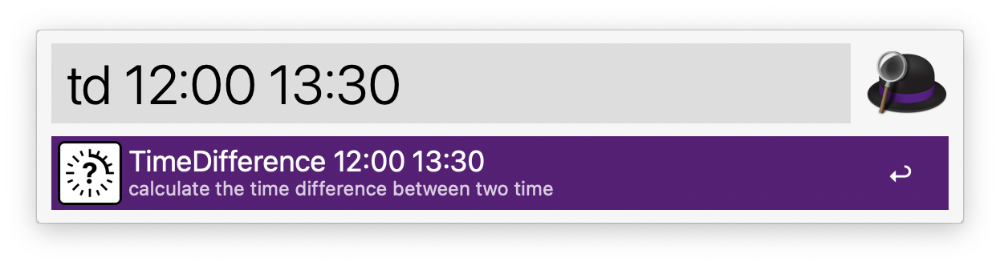
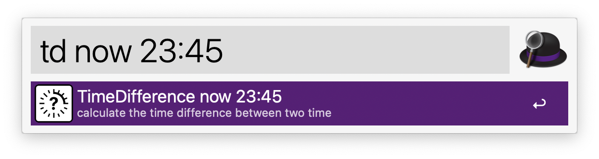
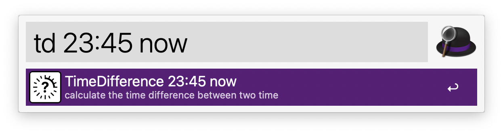
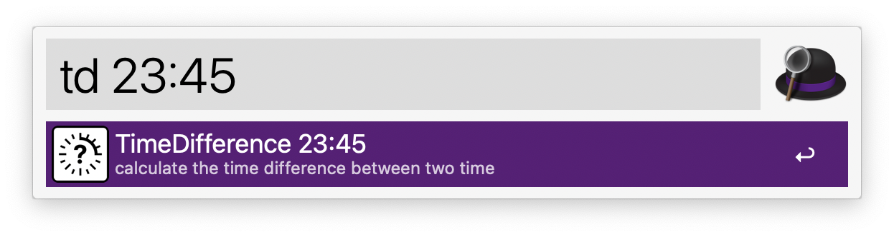
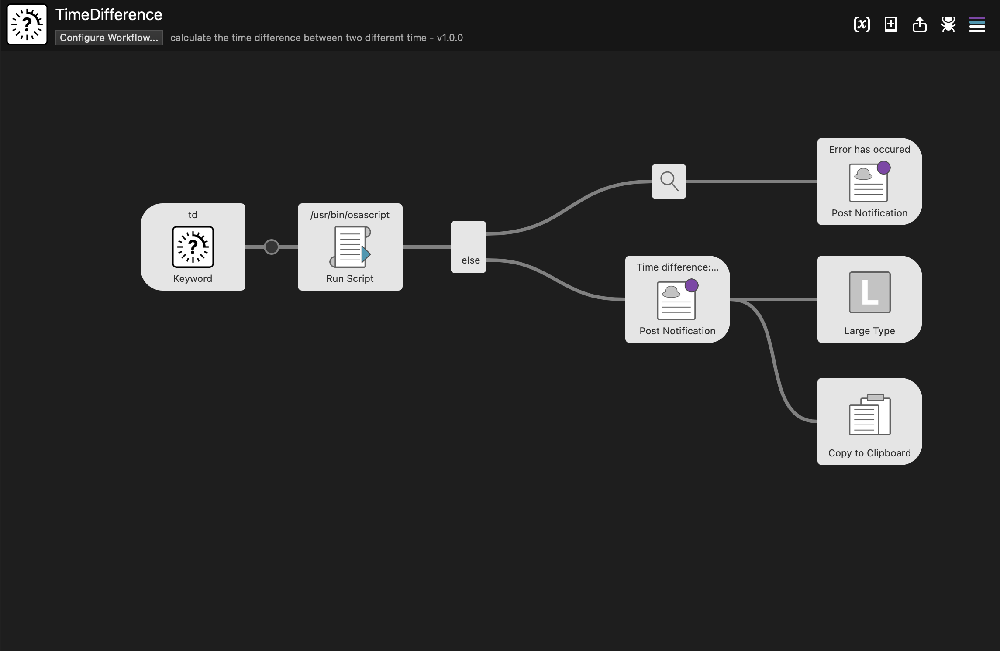

# Alfred Time Difference

This workflow helps you to calculate the time difference between two time.

## Download

You can download the latest version from GitHub [release page](https://github.com/owfdr/alfred-time-difference/releases), or just click below.

## How to Use

Type `td` to invoke command.

- `td 12:00 13:30` calculates the time difference between `12:00` and `13:30`.

- `td now 23:45` calculates the time difference between `now` and `23:45`.

- `td 23:45 now` is also accepted.

- or just `td 23:45` if you are really in a hurry. 💨

Result will be displayed something like this:

... also copied to your clipboard! 🎉

## Flowchart

## License

MIT
